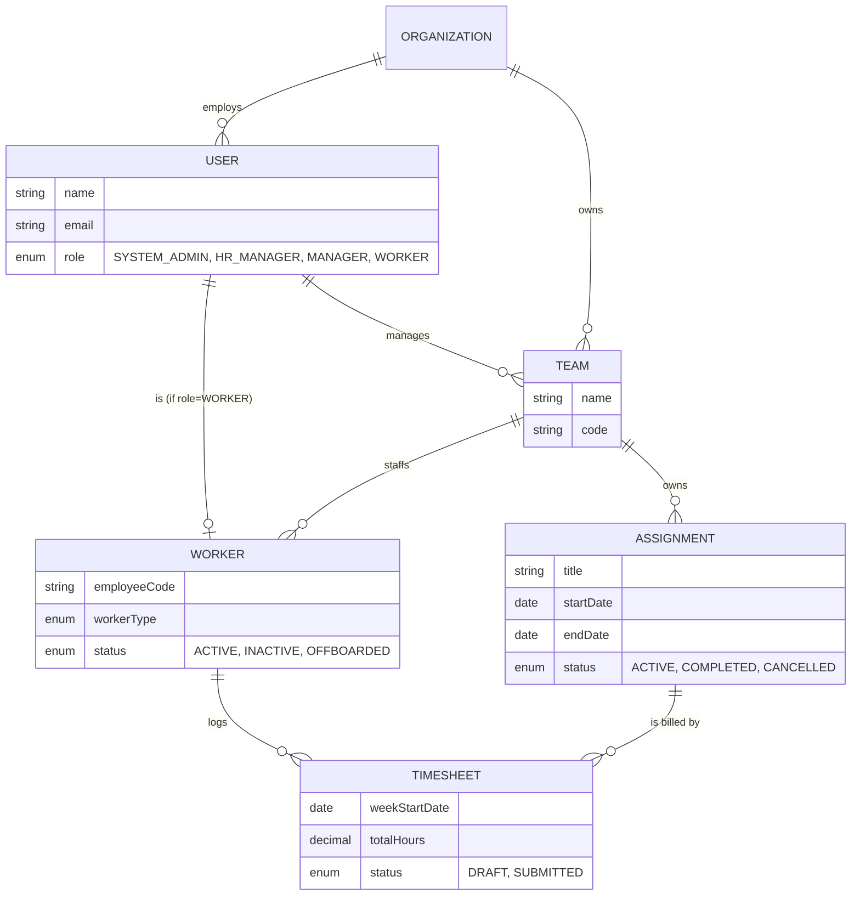

# MVP 1 — Workforce Management Foundation

*A 3–5 minute walkthrough of what was built, why, and how to see it work.*

---

## 1. The pitch

A small company runs its workforce on spreadsheets: who's on which team, who's
assigned to what, and how many hours they logged this week. MVP 1 replaces
that with a real backend (Spring Boot + MySQL) and a React client that four
roles — **admin, HR, manager, worker** — each use for exactly what their job
needs, nothing more.

**One sentence:** onboard a worker, put them on a team, assign them work,
they log their hours, a manager can see it, HR can offboard them — and every
step is permission-checked and audited.

---

## 2. The data model



`User` is the login identity for every role. `Worker` is the employment
record that only exists for the `WORKER` role — that split keeps identity and
employment data from being duplicated on every table.

---

## 3. The four roles, one job each

| Role | Owns |
| --- | --- |
| **System Admin** | Organization structure: creates teams, assigns their manager |
| **HR Manager** | The worker lifecycle: onboard, update, offboard |
| **Manager** | Work: creates assignments for their own team, closes them out |
| **Worker** | Their own hours: opens a week, edits it while it's a draft, submits it |

Every endpoint is gated twice: a **role** check (`@PreAuthorize` — "can this
role call this at all?") and a **resource-ownership** check in the service
layer ("does this specific record belong to *this* caller?"). A manager
reading another manager's team, or a worker reading someone else's
timesheet, both get `403` — for different reasons, with different error
codes (`ACCESS_DENIED` vs `UNAUTHORIZED_RESOURCE_ACCESS`), so the frontend
can tell "hide this button" apart from "this isn't yours."

---

## 4. The workflow

```
Admin creates a team, assigns a manager
        │
        ▼
HR onboards a worker onto that team
        │
        ▼
Manager assigns the worker a piece of work
        │
        ▼
Worker opens a week (DRAFT), fills in daily hours, submits it (SUBMITTED)
        │
        ▼
Manager reads the submitted week — the server computed the total, never the client
        │
        ▼
HR offboards the worker when the engagement ends — history stays readable
```

Nothing is ever hard-deleted. Every lifecycle (worker, assignment, timesheet)
moves through statuses instead, so historical data is always still there.

---

## 5. What was actually built

- **8 tables**, migrated with Flyway, validated against the JPA entities at
  boot (`ddl-auto=validate` — if the schema and the code ever disagree, the
  app refuses to start rather than silently improvising).
- **5 resource modules** (`auth`, `team`, `worker`, `assignment`, `timesheet`)
  each with the same shape: Entity → Repository → Service → Controller → DTO,
  so a new engineer can find their way around any of them the same way.
- **Stateless JWT auth** — no sessions, the token carries role + organization,
  every query is scoped by both.
- **An audit log** — every create/status-change writes a row: who, what,
  when. `WORKER_ONBOARDED`, `ASSIGNMENT_CREATED`, `TIMESHEET_SUBMITTED`, etc.
- **A React client** wired to the real API (not mocked) with role-aware
  navigation — a worker never even sees a "Teams" tab.

---

## 6. Live demo script (~4 minutes)

Seeded accounts, password `Password123!` for all of them:

| Step | Actor | Action |
| --- | --- | --- |
| 1 | `admin@example.com` | Log in → dashboard shows org-wide totals |
| 2 | `manager@example.com` (David Miller) | `GET /api/manager/teams` → Backend Engineering, his own only |
| 3 | `manager@example.com` | `GET /api/manager/workers` → John Carter, David Kumar, Kevin Zhao |
| 4 | `john@example.com` | `GET /api/workers/me` → his own profile, his team |
| 5 | `john@example.com` | `GET /api/assignments/my` → the Website Migration work |
| 6 | `john@example.com` | `POST /api/timesheets` for the week of `2026-08-17` → `DRAFT` |
| 7 | `john@example.com` | `PUT .../entries` a couple of times → total recalculates server-side |
| 8 | `john@example.com` | `POST .../submit` → `SUBMITTED`, now frozen |
| 9 | `manager@example.com` | `GET /api/manager/timesheets?status=SUBMITTED` → sees John's week |
| 10 | `hr@example.com` | `POST /api/workers/{id}/offboard` on any worker → still fully readable afterward |

That's the whole loop, start to finish, four different logins, one shared
dataset.

---

## 7. Deliberately not in scope

- No approval step on a timesheet — `SUBMITTED` means "the worker is done,"
  not "a manager signed off." (Approval belongs one level up, on an
  **invoice** — see [MVP2.md](MVP2.md).)
- No leave management, no task-level breakdown, no reassignment.
- No self-registration, password reset, or refresh tokens.
- Nothing is hard-deleted.

Full endpoint-by-endpoint reference: [api.md](api.md).
