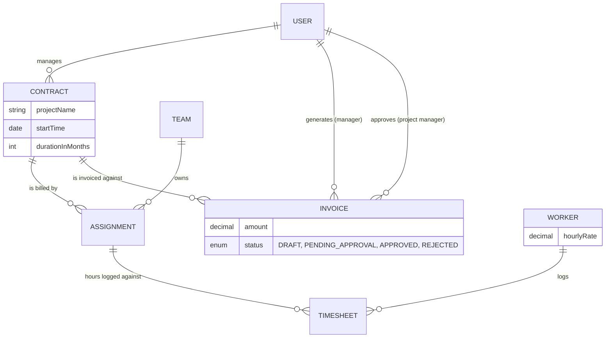
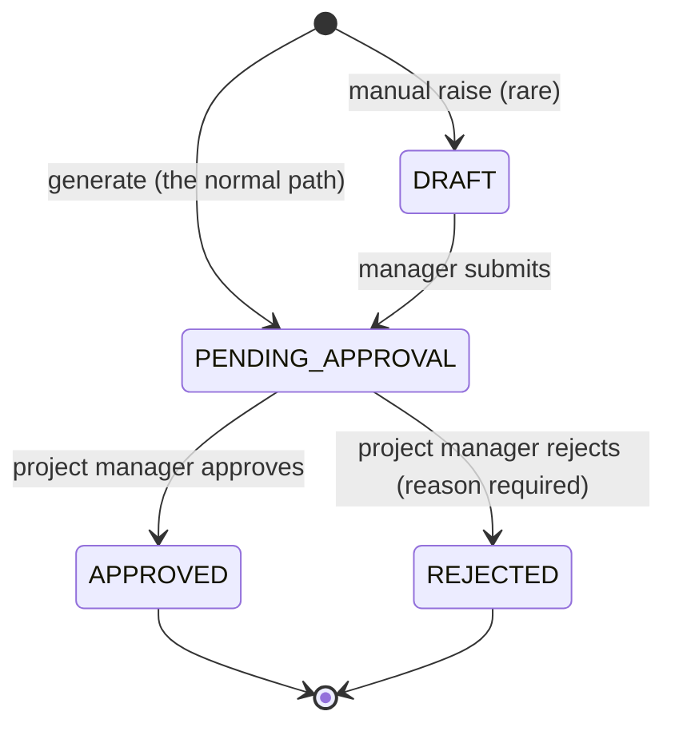

# MVP 2 — Team Assignments & Milestone Billing (T&M)

*A 3–5 minute walkthrough of what changed, why, and how to see it work.*

---

## 1. The pitch

MVP 1 proved the workforce loop: onboard, assign, log hours. MVP 2 answers
the question that loop was always building toward — **"so how do we get
paid for this?"** It turns logged hours into money: a manager verifies the
week, generates an invoice with one call, and a project manager approves or
rejects it. No spreadsheet, no manual multiplication, no copy-pasting hours
into an invoice template.

**One sentence:** work moved from "one worker's assignment" to "a team's
assignment against a contract," so that the hours logged against it can be
summed, priced at each worker's own rate, and billed in one step.

---

## 2. The architecture decision, and why

**Before (MVP 1):** an `Assignment` belonged to exactly one `Worker`.

**After (MVP 2):** an `Assignment` belongs to a **Team**, and bills against a
**Contract**. Any active worker on that team can log hours against it.

Why the change? Real project work isn't done by one person. "Migrate the
website" is Team Backend's job — John *and* David Kumar both put hours
against it in the same week. The old model couldn't represent that; the new
one does, without adding a junction table — `team_id` on `assignments` is
still the only ownership column, exactly as before, just pointed at a team
instead of a worker.

| | MVP 1 | MVP 2 |
| --- | --- | --- |
| Assignment owner | one `Worker` | one `Team` |
| Who can log hours | that one worker | any active worker on the team |
| Timesheet uniqueness | `(assignment, week)` | `(assignment, **worker**, week)` |
| Billing | none | `hours × worker's hourly rate`, summed |
| New role | — | `PROJECT_MANAGER` — approves/rejects invoices |
| New entities | — | `Contract`, `Invoice` |

---

## 3. The data model additions



`Worker.hourlyRate` is the one new field that makes billing possible —
everything else is relationships.

---

## 4. The billing calculation

`POST /api/invoices/generate` does the arithmetic no one should do by hand:

1. Find every `Assignment` on the contract.
2. Find every `SUBMITTED` `Timesheet` against those assignments.
3. For each: `totalHours × worker.hourlyRate` — in `BigDecimal`, never a
   float, because rounding a payroll number is not a rounding error you get
   to make.
4. Sum them. Create the `Invoice` at that amount, `status = PENDING_APPROVAL`
   — already routed to the project manager, no separate submit step.

**Worked example**, straight from the seeded data: on the *Website
Migration* contract, John Carter logged 40 hours at $50/hr and David Kumar
logged 40 hours at $65/hr in the same week, against the same team assignment.

```
John:  40h × $50.00/hr = $2,000.00
David: 40h × $65.00/hr = $2,600.00
                          ─────────
                          $4,600.00
```

One API call, one real number, zero spreadsheets.

---

## 5. The approval workflow



Every arrow is a single forward step — there's no un-approving, no
un-rejecting, and no resubmitting a decided invoice. A rejection always
carries a reason, because "no" without a reason isn't actionable.

---

## 6. Live demo script (~4 minutes)

Seeded accounts, password `Password123!`:

| Step | Actor | Action |
| --- | --- | --- |
| 1 | `manager@example.com` (David Miller) | `GET /api/contracts` → Website Migration, Payments Platform, both his |
| 2 | `manager@example.com` | `GET /api/manager/timesheets?status=SUBMITTED` → John's and David Kumar's weeks, both `SUBMITTED` |
| 3 | `manager@example.com` | `POST /api/invoices/generate` with `contractId` = Website Migration, `projectManagerId` = Priya → **`$4,600.00`, `PENDING_APPROVAL`**, computed live |
| 4 | `pm@example.com` (Priya Menon) | `GET /api/invoices?status=PENDING_APPROVAL` → the invoice just generated, plus one seeded from before |
| 5 | `pm@example.com` | `POST /api/invoices/{id}/approve` → `APPROVED` |
| 6 | `pm2@example.com` (James Anderson) | `GET /api/invoices?status=REJECTED` → a seeded example, with its rejection reason visible |
| 7 | *(optional second pass)* | `manager3@example.com` (Michael Torres) generates against **Analytics Warehouse Migration** → Nina ($70/hr) + Carlos ($58/hr), 40h each → **`$5,120.00`** — proves the formula isn't hardcoded to one contract |

Everything in that table is real data already in the database — nothing
needs to be created first. See [api.md §13](api.md#13-local-test-accounts)
for the full 21-account roster this demo pulls from.

---

## 7. What was actually built

- **1 breaking migration** (`V8`) that removes `assignments.worker_id`,
  backfills `timesheets.worker_id` from it first so no history is lost, and
  adds `assignments.contract_id` and `workers.hourly_rate`.
- **2 new modules** (`contract`, `invoice`) plus a **new role**
  (`PROJECT_MANAGER`) threaded through every existing permission check —
  including the 10 pre-existing role-`switch` statements across the
  codebase (teams, workers, assignments, timesheets, dashboard) that would
  otherwise have silently mis-scoped that role's access.
- **The billing method itself**: `InvoiceService.generateInvoiceForContract`
  — pure `BigDecimal` arithmetic, a custom `NoBillableTimesheetsException`
  when there's nothing to bill, and an audit trail on every invoice raised.
- **8 existing test files updated** for the new model, plus new coverage
  proving two teammates really can share one assignment and one week.
- **The React client updated to match** — assignment creation now picks a
  team + contract instead of a worker; onboarding has an hourly-rate field;
  a "Milestone Billing" quick-generate form sits next to the manual one.

---

## 8. Known limitation (by design, for now)

`POST /api/invoices/generate` does **not** track which timesheets have
already been billed — there's no "invoiced" flag on a `Timesheet` yet.
Generating twice for the same contract before new hours are logged will bill
the same hours again. Fine for a demo; the first thing a real MVP 3 would add.

Full endpoint-by-endpoint reference: [api.md](api.md).
