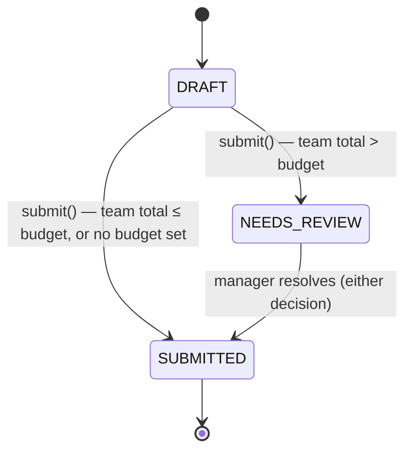
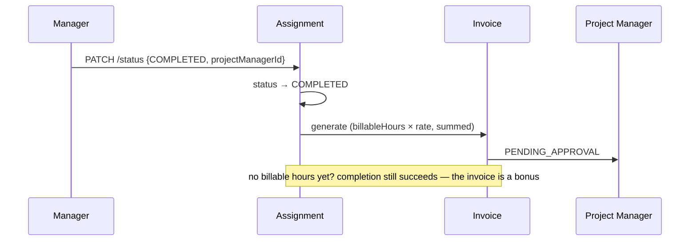

# MVP 3 — Soft Cap Review & Automated Invoicing

*A 3–5 minute walkthrough of what changed, why, and how to see it work.*

---

## 1. The pitch

MVP 2 proved the billing loop: log hours, generate an invoice, get it
approved. It also billed every submitted hour blindly — a milestone with a
40-hour budget and 80 hours logged against it was invoiced for 80, no
questions asked. MVP 3 puts a human back in that loop exactly where it
matters: when a team blows through its budget, a manager decides what's
billable before it ever reaches an invoice. And once work is actually done,
the invoice for it no longer needs a second, separate API call to raise.

**One sentence:** an assignment can now carry a budget, a submission that
breaks it detours to a manager for one yes/no decision instead of billing
silently, and finishing the milestone can hand the resulting invoice straight
to a project manager in the same action that closes it out.

---

## 2. The Soft Cap Rule

**Before (MVP 2):** `Assignment` had no budget field. Every `SUBMITTED`
timesheet was billed in full, however many hours it carried.

**After (MVP 3):** an assignment optionally carries `allocatedHours`. When a
worker submits a week, the server adds it to everything already logged
(`SUBMITTED` + `NEEDS_REVIEW`) against that assignment, across the whole
team — not just that one worker. Over budget, and the week lands
`NEEDS_REVIEW` instead of `SUBMITTED`; under or equal, nothing changes from
MVP 2.

It is deliberately **not** a hard cap. Nothing stops a worker from logging
and submitting the hours — the rule only stops them from being billed
without a manager looking at them first. No new table, either:
`assignments.allocated_hours` and `timesheets.billable_hours` are the only
two columns MVP 3 adds (see [api.md](api.md) §7–8 for the full field
reference).

---

## 3. The manager's decision

`POST /api/timesheets/{id}/review` — one call, one boolean:

| `approveOverage` | Manager Dashboard label | Effect |
| --- | --- | --- |
| `true` | **Approve Total Time (Includes Overtime)** | every logged hour becomes billable |
| `false` | **Approve Allocated Time Only (Cap at Budget)** | billable hours are capped at `allocatedHours`; the overage is discarded — never billed, never deleted, the timesheet still shows what was actually worked |

Either decision returns the week to `SUBMITTED`. The decision itself lives in
one new column, `timesheets.billable_hours` — `null` for every ordinary
week (meaning "same as `totalHours`"), only ever set here. Milestone Billing
(`POST /api/invoices/generate`, and the automated handoff below) sums
`billableHours`, not `totalHours`, so a capped overage is mathematically
incapable of reaching an invoice.

---

## 4. Automated Handoff

**Before (MVP 2):** generating an invoice was always a separate manual step —
`POST /api/invoices/generate`, named contract, named project manager.

**After (MVP 3):** `PATCH /api/assignments/{id}/status` accepts an optional
`projectManagerId` alongside `status`. Setting `status` to `COMPLETED` with a
project manager named bills every `SUBMITTED` (i.e. billable) timesheet on
that assignment's contract and routes the resulting invoice to them, in the
same call that closes out the milestone.

Nothing billable yet, or no project manager named — the assignment still
completes; raising the invoice is never a precondition. The plain
`POST /api/invoices/generate` call from MVP 2 still exists unchanged for
whenever a manager wants to bill without closing the milestone out.

---

## 5. PDF export

`GET /api/invoices/{id}/pdf` — same visibility rule as `GET
/api/invoices/{id}`, a formatted PDF back instead of JSON (OpenPDF,
`com.lowagie.text`). It shows the contract, billing period,
manager/project-manager, and a per-line breakdown — assignment, worker, hours
billed, rate, line amount — reconstructed from the same `SUBMITTED`
timesheets the invoice was billed from, so a Soft Cap Rule cap shows up here
too. `Invoice` never persisted line items (that was already true in MVP 2 —
only the aggregate `amount` is stored), so the breakdown is rebuilt on
demand rather than replayed from a stored table; a manually-raised invoice
with no matching timesheets simply renders without one.

---

## 6. Live demo script (~3 minutes)

Seeded accounts, password `Password123!`:

| Step | Actor | Action |
| --- | --- | --- |
| 1 | `manager4@example.com` (Elena Rodriguez) | `GET /api/timesheets?status=NEEDS_REVIEW` → Aisha Bello's week on **iOS/Android Core Rewrite**, already flagged — Tom's seeded 40h plus Aisha's 16h is 56h against a 10h budget |
| 2 | `manager4@example.com` | `POST /api/timesheets/{id}/review` with `approveOverage: false` → status back to `SUBMITTED`, `billableHours` capped at `10.00` (down from her own `16.00` logged) |
| 3 | `manager4@example.com` | `PATCH /api/assignments/{id}/status` on iOS/Android Core Rewrite with `{status: "COMPLETED", projectManagerId: <pm id>}` → assignment closes, an invoice appears in the project manager's queue in the same call |
| 4 | `pm@example.com` (Priya Menon) or `pm2@example.com` (James Anderson) | `GET /api/invoices?status=PENDING_APPROVAL` → the new invoice, billed at Tom's full 40h plus Aisha's capped 10h — never her raw 16h, never the discarded overage |
| 5 | *(either project manager)* | `GET /api/invoices/{id}/pdf` → downloads a formatted PDF with that same breakdown |

Everything above is real seeded data — nothing needs to be created first. See
[api.md §13](api.md#13-local-test-accounts) for the full account roster.

---

## 7. What was actually built

- **1 migration** (`V9`) adding exactly two columns — `assignments
  .allocated_hours` and `timesheets.billable_hours` — no new tables, per the
  MVP 3 constraint. Both are nullable, so every MVP 1/MVP 2 assignment and
  timesheet keeps behaving exactly as before.
- **One new timesheet status**, `NEEDS_REVIEW`, and two new `Timesheet`
  methods (`flagForReview`, `resolveReview`) that own the transition — the
  service layer decides *when* to flag, the entity enforces *how*.
- **`AssignmentService` now depends on `InvoiceService`** — the one new
  cross-module wire, needed for completion to raise an invoice in the same
  transaction. No cycle: `InvoiceService` never depended on `AssignmentService`.
- **`InvoicePdfService`**, a new OpenPDF-backed renderer, plus a fourth
  `TimesheetRepository` query (`findBillableForInvoicePeriod`) that feeds it
  the same billable timesheets Milestone Billing itself bills by.
- **The React client updated to match**: an optional budget field on
  assignment creation, a "Mark completed & auto-invoice" action, a Soft Cap
  Review section on the Timesheets screen with the two approval buttons, and
  a Download PDF button on every invoice card.

---

## 8. Known limitations (carried over, and new)

- Milestone Billing still has **no "already invoiced" flag** on a timesheet
  (MVP 2's known limitation, unchanged) — generating twice for the same
  contract before new hours are logged bills the same hours again. The
  Automated Handoff in §4 does not fix this; it is the same
  `generateInvoiceForContract` under the hood.
- The Soft Cap Rule checks the **team's** total against the budget, but a
  manager's review decision caps that **one flagged timesheet's** billable
  hours at the full budget — it does not proportionally split the budget
  across multiple teammates who are each over it independently. Fine for a
  single flagged week per review, which is the common case.
- The PDF's line-item breakdown is reconstructed from timesheets whose week
  falls inside the invoice's billing period, not read from a stored
  link — see §5. A manually-entered invoice with a period that doesn't line
  up with real timesheet weeks renders without a breakdown table.

Full endpoint-by-endpoint reference: [api.md](api.md).
